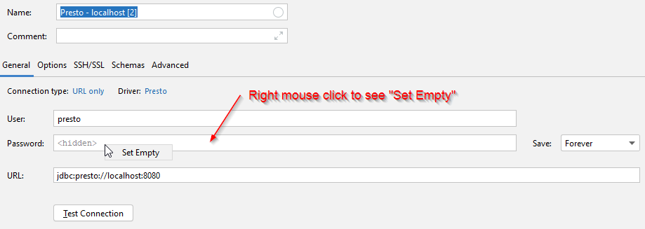

# Start Presto from docker
```shell
docker run -v "$(pwd)/etc:/etc/trino" -p 8080:8080 --name trino trinodb/trino 
```

# Start Presto CLI
```shell
docker exec -it trino trino
```

# Presto Web interface
Open in any browser: http://localhost:8080/ui/

# References
1. https://github.com/trinodb/trino/blob/master/core/docker/README.md
2. https://docs.starburstdata.com/323-e/docker.html
2. https://www.starburstdata.com/prestosql-and-prestodb/

# Default credentials
1. User: presto
2. Password: _empty password_
3. URL: jdbc:presto://localhost:8080
<!---
SSL variant but it does not work:
2. Password: <password>
3. URL: jdbc:presto://localhost:8080?SSL=true&SSLKeyStorePath=C%3A%5Cdev%5Cprestosql%5Cetc%5Ckeystore.jks&SSLKeyStorePassword=Oozahn7Lie%23Zeethoh5e
-->

# JetBrains configuration


# PowerBI configuration via ODBC
https://www.magnitude.com/blog/how-connect-presto-to-powerbi 

```text
Driver={Simba Presto ODBC Driver};Host=127.0.0.1;Port=8080;
```
